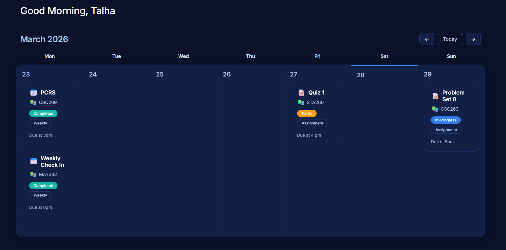

# Uni-Dashboard

> A **weekly planner for university coursework** — see assignments, labs, and deadlines in a clean week-at-a-glance layout, with create and edit flows for each task.



[](.)
[](https://react.dev/)
[](https://nodejs.org/)

---

## Why this exists

Balancing multiple courses means juggling due dates, recurring check-ins, and different task types. Uni-Dashboard is a focused UI experiment: **calendar navigation**, **per-day task lists**, and **structured task metadata** (course, status, type, notes) in one place — built to grow toward real data and auth later.

---

## Highlights

| Area | What you’ll see in the repo |
|------|-----------------------------|
| **React** | Functional components, `useState` / `useMemo`, client-side routing between dashboard and create/edit screens |
| **UX** | Week header with prev/next/today, today highlighting, task cards with status affordances |
| **Structure** | Split components (`WeekCard`, `DayCard`, `TaskCard`, `CreateTask`, etc.) and dedicated CSS modules |
| **Stack direction** | Frontend runs without a bundler (React 18 + Babel standalone); backend folder includes a **PostgreSQL** client for future persistence |

---

## Tech stack

- **Frontend:** React 18 (UMD), React DOM, Babel Standalone, vanilla CSS (Inter font, dark theme)
- **Backend (early):** Node.js + `pg` — intended for `uni_dashboard`-style persistence; API routes are not yet exposed in the current stub

---

## Getting started

### Frontend (dashboard UI)

1. Clone the repository.
2. Serve the `frontend` folder over HTTP (recommended so module/Babel loading behaves consistently):

   ```bash
   npx --yes serve frontend
   ```

   Then open the URL shown in the terminal (e.g. `http://localhost:3000`).

   Alternatively, open `frontend/index.html` in a browser if your environment allows local script loading.

**This project is under active development.** Features and architecture may change; persistence and API layers are still being wired up.

### Backend

1. Install [Node.js](https://nodejs.org/) and run `npm install pg` in the `backend` directory if you add a `package.json`, or install `pg` globally / locally as you prefer.
2. Create a PostgreSQL database and **configure connection settings** in `backend/server.js` (or move credentials to environment variables before committing — never commit secrets).

---

## Project layout

```
frontend/
  App.jsx              # Week state, task map, navigation
  components/          # Cards, week header, create/edit form
  styles/              # Component styles
backend/
  server.js            # DB client (connection stub)
```

---

## Roadmap (indicative)

- REST or RPC API for tasks and weeks
- Environment-based configuration and secure credential handling
- Optional build tooling (Vite/Webpack) for production bundles
- Auth and multi-user support

---

*Portfolio-oriented full-stack learning project.*
